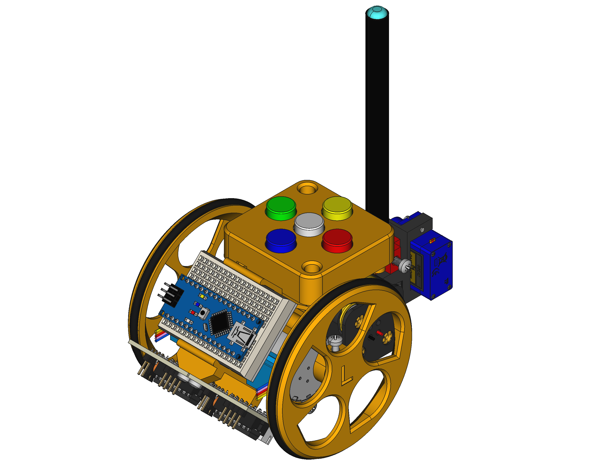
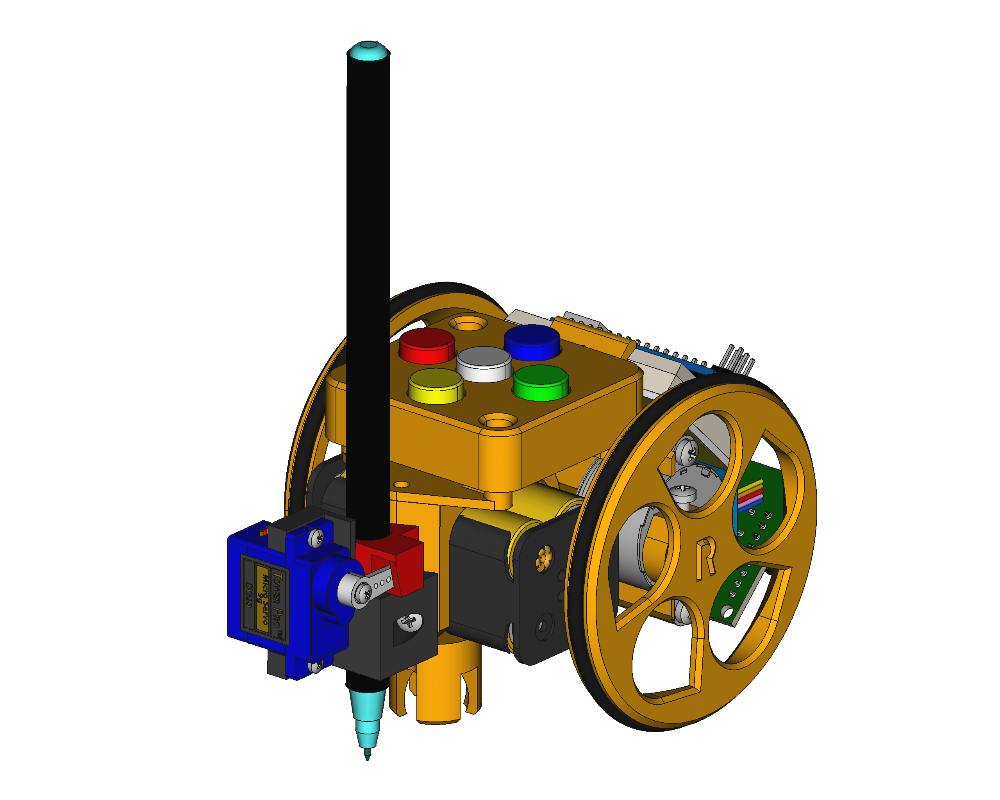
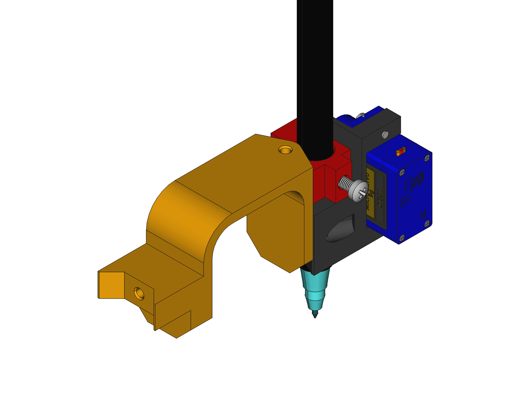

# Escornabot Pintor Kit

Piezas 3D para añadir al soporte de pilas de la versión [Escornabot Brivoi-DIY](https://github.com/roboteach-es/escornabot) y convertir el **Escornabot** en **Pintor**.

Elementos necesarios:
- Escornabot Brivoi-DIY
- Piezas [3D](3D/) (soporte del servo y soporte de rotulador)
- 1 Rotulador (se ha utilizado un edding 1200)
- 1 Servo SG90
- 2 Tornillos «rosca chapa» din-7981 2.9×9.5 (ISO 7049) (para fijar la pieza al Escornabot)
- 1 Tornillo «rosca métrica» din-7985 M3x10 (ISO 7045) (para fijar la posición del rotulador)
- 1 Condensador de 470 &mu;F (_opcional_, se utiliza para que funcione mejor el servo)

### [**3D**](3D/)

Piezas modeladas en [FreeCAD](www.freecadweb.org).

### [**Código**](Código/)

Es necesario tener instalada en mblock la extensión:
- [**EscornabotDIY de _ROBOteach_**](https://github.com/roboteach-es/mBlock3-extensions/tree/master/RT_EscornabotDIY)

El archivo [Test_distancia_rotulador_eje_ruedas.sb2](Código/Test_distancia_rotulador_eje_ruedas.sb2) es un código para calcular **la distancia entre el rotulador y el eje de las ruedas** para lo cual se procede de la siguiente manera, se pulsa ATRÁS - GIRO DERECHA o ATRÁS - GIRO IZQUIERDA, se mide el diámetro de la circunferencia trazada y la mitad de esa medida se introduce en la variable _dist_eje_punta_ de los códigos de mblock [Escornabot_Pintor_Kit](Código/Escornabot_Pintor_Kit.sb2) o [Escornabot_Pintor_Kit_programable](Código/Escornabot_Pintor_Kit_programable.sb2).

En esta animación se muestra el proceso [Test_distancia.gif](Código/Test_distancia.gif)

### [**Conexiones**](Conexiones/)

* Se hace un puente entre Ground y una columna sin usar de la mini placa de prototipado (tal y como aparece en el [esquema](Conexiones/Conexiones_Kit_Pintor.png)).

* Se conectan los siguientes elementos:

	- Servo (SG90)
		- cable rojo a _VIN_
		- cable marrón a _GND_
		- cable naranja a _D11_
	- Condensador
		- positivo a _VIN_
		- negativo a _GND_

## LICENSE

This work is licensed under the [GNU General Public License v3.0](LICENSE-GPLV30). All media and data files that are not source code are licensed under the [Creative Commons Attribution 4.0 BY-SA license](LICENSE-CCBYSA40).

More information about licenses in [Opensource licenses](https://opensource.org/licenses/) and [Creative Commons licenses](https://creativecommons.org/licenses/).